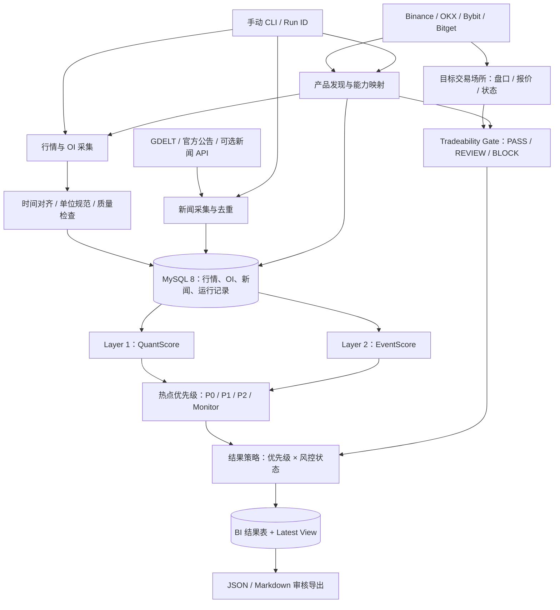

# Market-Analysis-Bot

> **Market Hotspot Intelligence System｜跨市场热点智能分析系统**
> 面向加密货币永续合约与美股关联交易产品，以「量化异动发现 + 新闻事件解释 + 独立交易风险闸门」生成可审计的市场热点排行榜。

## 1. 项目简介

本项目计划构建一个**手动运行、基于 MySQL 8 的市场热点分析管线**。系统从 Binance、OKX、Bybit、Bitget 等数据源发现并区分真实交易产品，采集价格、成交量、未平仓合约（OI）及订单簿数据；通过统计方法发现异常行情，结合可追溯的新闻与官方事件解释其背景，再根据目标交易场所的流动性评估，输出面向 BI 的热点排名及 JSON／Markdown 审核材料。

**核心原则：市场热度不等于交易建议。** `Hotspot Priority` 与 `Tradeability Status` 独立输出；高热度但未通过流动性验证的产品仍可展示在内部排行榜，却不得自动进入交易导向营销。

> **当前阶段：MVP 基础开发。** 已提供 MySQL 迁移、Binance USD-M 加密永续产品发现与快照采集、OI 时间容忍计算、评分与风险基础模块；尚不包含 API 凭证、定时调度、自动营销或实盘交易功能。

## 2. MVP 范围

| 包含（MVP） | 不包含（本阶段） |
| --- | --- |
| 手动 CLI 运行、Binance 产品发现与快照采集 | 自动 Scheduler／后台常驻服务 |
| 公开市场行情采集与来源支持的历史回补 | 未获授权的私有市场数据抓取 |
| 复用 `DB_URL`／PyMySQL 连接 MySQL 8 | 新增独立时序数据库 |
| 5 分钟粒度快照**格式**及 OI 1H／4H／24H 计算 | 保证每 5 分钟自动采集 |
| 量化异动评分与显式数据质量状态 | 将热点评分直接当作交易 Alpha |
| 新闻检索、事件匹配、可选 LLM 结构化提取 | 依赖付费 News API 或 LLM 才能运行 |
| 流动性／点差／滑点风险闸门基础模块 | 自动下单、账户资金与策略执行 |
| MySQL BI 结果表／最新 View、JSON 和 Markdown | Lark、CRM、自动推播或活动发布 |

### 13 个观察标的

- **加密货币：** `XRPUSDT`、`DOGEUSDT`、`ADAUSDT`、`TRXUSDT`、`ZECUSDT`、`HYPEUSDT`、`AVAXUSDT`、`WLDUSDT`、`WLFIUSDT`、`ALEOUSDT`
- **股票相关：** `TSLAUSDT`、`NVDAUSDT`、`PLTRUSDT`

列表中的符号是**观察标的标识**，不表示这些字符串在任一交易所均有对应合约。系统必须动态发现实际 `instrument_id`、产品类型与交易状态；不存在或不支持的产品标记为不可用，不允许用其他产品的价格或 OI 填补。

## 3. 系统架构（MVP）



> 排行榜的 P0/P1/P2 **不因风控失败而改级**。例如 `P0 + REVIEW` 代表「高热度、禁止自动交易导流」，而不是降为 P1。

完整分层架构、数据流、存储模型与风控状态机见 [architecture.md](docs/architecture.md)。

## 4. 核心模块

| 模块 | 输入 | 输出 |
| --- | --- | --- |
| 产品发现（Instrument Discovery） | 交易所产品目录 | 精确交易产品映射与可用指标 |
| 市场采集（Market Ingestion） | 行情／OI／盘口 API | 原始快照、数据质量状态 |
| 特征工程（Feature Engineering） | 历史行情与 OI | 价格 Z-Score、成交量/OI 历史分位数等 |
| 量化检测（Quant Detection） | 标准化指标 | `QuantScore` 及分项依据 |
| 新闻归因（Event Attribution） | 新闻／公告、资产映射 | `EventScore`、证据链接、因果状态 |
| 热点排序（Ranking） | QuantScore＋EventScore | P0／P1／P2／Monitor |
| 交易风险（Tradeability） | 目标场所产品状态、盘口与执行模拟 | `PASS`／`REVIEW`／`BLOCK` |
| BI 导出（Output A） | 排行、证据与风控审计 | MySQL 表／View、JSON、Markdown |

### 热点初始分级

在量化与事件数据均有效时：

`HotspotScore = 0.65 × QuantScore + 0.35 × EventScore`

| 等级 | 默认条件 | 说明 |
| --- | --- | --- |
| **P0** | 总分 ≥80，且 Quant ≥70、Event ≥60 | 核心热点；是否可导流由风控独立决定 |
| **P1** | 总分 60～<80，或触发单项高强度规则 | 重点关注 |
| **P2** | 总分 40～<60 | 一般热点 |
| **Monitor** | 总分 <40 | 持续监控 |

- `Quant ≥80 且 Event <60`：最多 P1，标记 `event_pending`。
- `Event ≥85 且 Quant <70`：事件型 P1，不声称已有价格异动。
- 新闻源不可用时，启用 `QUANT_ONLY` 排序：`EventScore` 与 `HotspotScore` 为 `NULL`，最高暂列 P1。
- 股票永续、rToken、CFD 与股票参考价均采用产品专属评分配置。

### 交易风险闸门（初始阈值）

| 条件 | 默认策略 |
| --- | --- |
| 已确认下架、停牌、不可交易或受地区限制 | `BLOCK` |
| 两侧各 1% 盘口深度 ≥50,000 USD，价差 ≤50 bps，5,000 USDT 双向模拟滑点 ≤100 bps，数据新鲜且完整 | `PASS` 候选 |
| 完整且有效的盘口显示任一侧深度不足，或滑点超限 | `BLOCK` |
| 盘口不可用、未授权、不完整或缺乏足够执行成本证据 | `REVIEW`，不得自动交易导流 |
| 关键价格或产品状态严重过期 | `BLOCK`；轻微延迟依配置进入 `REVIEW` |

数值均为 **MVP 初始测试阈值**，实际应按目标交易场所、产品及订单规模校准。外部交易所流动性不能替代实际导流场所的盘口。

## 5. 数据完整性与产品隔离

- **精确产品键：** `(venue, product_type, instrument_id)`；`underlying_asset` 仅用于新闻与主题映射。
- **不可混用：** 股票永续的 OI 不可赋给同一股票的 rToken／CFD；不同交易所的 OI、账户多空比及成交流指标独立存储。
- **时间：** 使用 UTC 保存 `source_ts`、`collected_at`、`available_at`、`as_of_ts`；回测不得使用尚未可得的数据。
- **缺失状态：** `NOT_APPLICABLE`、`UNAVAILABLE`、`STALE`、`INCOMPATIBLE`、`INSUFFICIENT_HISTORY`，与真实数值 0 严格区分。
- **OI 24H：** 仅与同一精确产品、相同单位、目标时间附近 ±5 分钟内的历史快照比较。
- **新闻因果：** 缺乏时序与来源证据时，表述为「可能相关背景」，不能宣称直接驱动行情。

## 6. 预计项目目录（尚未实现）

```text
Market-Analysis-Bot/
├── README.md
├── docs/
│   └── architecture.md
├── market_hotspot/
│   ├── cli.py
│   ├── sources/
│   ├── ingestion/
│   ├── processing/
│   ├── features/
│   ├── intelligence/
│   ├── risk/
│   ├── storage/
│   └── export/
├── migrations/
├── tests/
└── .env.example
```

## 7. 后续路线

**MVP（当前规划）：** 手动运行 → MySQL 数据持久化 → Quant／Event 评分 → 独立风险闸门 → Output A。

**下一阶段：** 采集排程、BI 仪表板、Lark 审核通知、CRM 内容交付。
**远期方向：** 历史 Feature Store、Alpha 研究、回测、模拟交易和受控执行风控；这些能力与营销决策链独立。

## 8. API 与参考文档

- [Binance USDⓈ-M Futures API](https://developers.binance.com/docs/derivatives/usds-margined-futures/market-data/rest-api)
- [OKX API v5](https://www.okx.com/docs-v5/en/)
- [Bybit V5 Market API](https://bybit-exchange.github.io/docs/v5/market/orderbook)
- [Bitget Market Data](https://www.bitget.com/docs/catalog/market/market-data)
- [Bitget Reality Trading Guide](https://www.bitget.com/docs/uta/reality-trading-guide)

> **开发状态声明：** 当前仅 Binance USD-M 加密永续适配器可执行；OKX、Bybit、Bitget、新闻归因、完整 BI 导出及全流程评分仍待实现。具体接口能力、权限与限额须在开发时逐项检测。

## 开发试运行

```bash
python3 -m pip install -r requirements.txt
export DB_URL='mysql+pymysql://<user>:<password>@<host>:3306/<database>?charset=utf8mb4'

# 建立 MVP 数据表
python3 -m market_hotspot.cli init-db

# 仅发现 Binance USD-M 加密永续产品，输出 JSON
python3 -m market_hotspot.cli discover

# 拉取当前市场快照，并写入 MySQL
python3 -m market_hotspot.cli ingest-market --persist
```

股票观察标的不会通过 Binance 的同名符号推断为股票永续产品，须由后续 OKX／Bybit／Bitget 的精确产品发现适配器验证；未发现时输出 `UNAVAILABLE`，不会替换为其他交易产品的数据。
