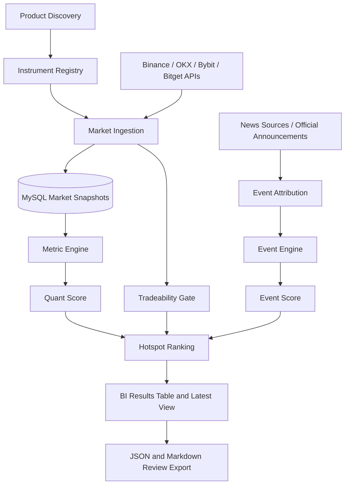

# Market-Analysis-Bot

Market Hotspot Intelligence System for crypto perpetuals and stock-linked trading products. The system keeps instruments distinct by venue and product type, detects quantitative market anomalies, attributes relevant news events, validates tradeability, and produces a BI-ready hotspot ranking.

## MVP Scope

- Manual market snapshots and supported historical backfills.
- MySQL-backed instrument metadata, market snapshots, OI metrics, news events, and hotspot rankings.
- Product-aware routing for crypto perpetuals, stock perpetuals, rTokens, CFDs, and stock references.
- Quantitative scoring, event attribution, tradeability risk checks, and JSON/Markdown/BI exports.
- No scheduler, automatic campaign delivery, Lark alerts, API credentials, or application implementation in this initial commit.

## Architecture

## Core Principles

- An identical underlying asset does not make products interchangeable. Price, OI, order book, and tradeability data stay bound to their exact venue and instrument ID.
- Market priority and tradeability are separate. A P0 hotspot can require review or be prohibited from trade-directed delivery.
- Missing, stale, unsupported, and insufficient-history metrics are explicit states. The system never fabricates an OI change or redistributes unavailable metric weights.
