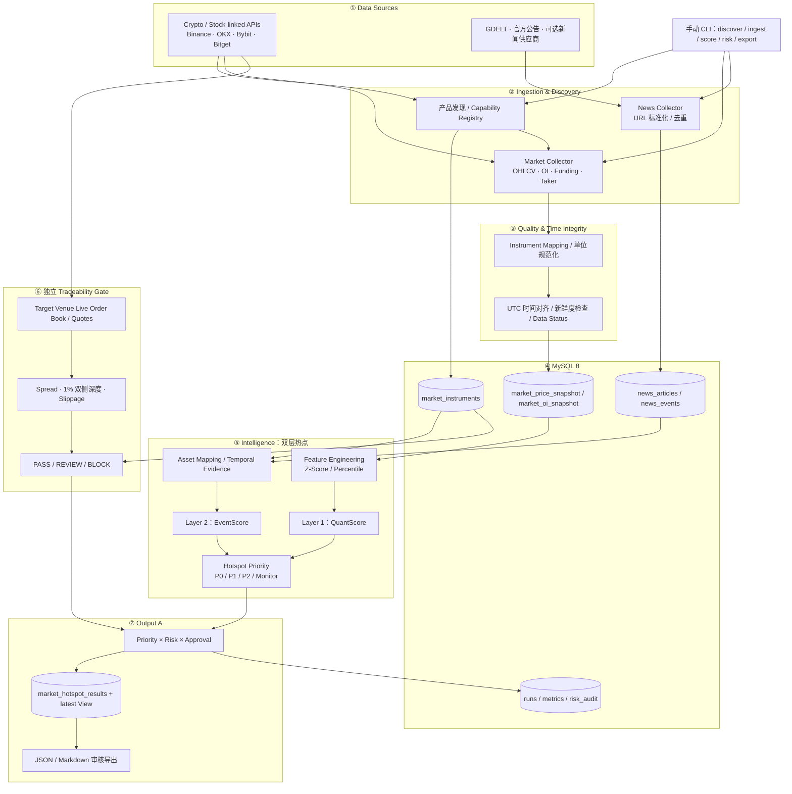
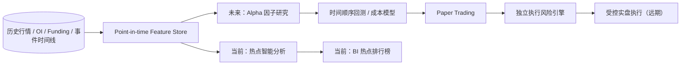

# Market-Analysis-Bot｜系统架构设计

**文档状态：** MVP 设计规范；基础实现已开始（当前仅 Binance USD-M 加密永续发现与快照采集可执行）

**交付目标：** Output A——可审计的 MySQL BI 热点排行榜，以及 JSON／Markdown 审核导出。
**运行模式：** 手动 CLI；不包含 Scheduler、Lark、CRM、自动推播及真实交易。

## 1. 架构目标与边界

系统负责回答三个问题：

1. **What is moving?** 哪个精确交易产品出现统计意义上的异常？
2. **What may explain it?** 哪条及时、可核验的新闻事件与异常相关？
3. **Can it be promoted safely?** 目标交易场所是否满足基本交易可用性与流动性要求？

输出为市场情报和营销审核候选，**不是预测性交易建议或自动下单系统**。热点优先级与风险闸门相互独立。

## 2. 总体架构（分层与双通道）



> 逻辑图中的评分、风险和决策都可在同一手动 CLI 进程内完成；**不要求引入微服务或消息队列**。`Tradeability Gate` 在风险检查时应尽可能重新取用目标场所的最新盘口，而非直接复用旧快照。

## 3. 产品隔离与路由规则

### 3.1 数据实体模型

| 字段 | 示例 | 说明 |
|---|---|---|
| `watch_symbol` | `TSLAUSDT` | 用户观察列表名称，仅用于查询／展示 |
| `underlying_asset` | `TSLA` | 新闻关系与跨产品主题映射 |
| `venue` | `OKX` | 真正的数据来源及交易场所 |
| `instrument_id` | 交易所发现的实际产品 ID | 不可推断、不允许随意拼接 |
| `product_type` | `STOCK_PERP` | `CRYPTO_PERP`／`STOCK_PERP`／`RTOKEN`／`CFD`／`STOCK_REFERENCE` |
| `contract_multiplier` | 依据合约规格 | OI 与名义金额换算 |
| `quantity_unit` | `contracts` 等 | 防止跨来源单位混淆 |
| `trading_status` | `TRADING`／`HALTED` | 是否可交易 |
| `capabilities` | `PRICE,OI,ORDERBOOK` | 每个产品逐项探测的可用能力 |
| `target_venue` | `Bitget` | 最终营销可能引导交易的场所 |

**关键约束：** 数据主键至少包含 `(venue, product_type, instrument_id)`。`underlying_asset` 相同不等于 `instrument_id` 相同；绝不把 OKX 股票 Perp 的 OI 分配给 Bitget Reality rToken。

### 3.2 数据供应路由

| 资产／产品 | 优先候选 | 需确认事项 | 处理方式 |
|---|---|---|---|
| 加密永续 | Binance；OKX／Bybit 分开保存 | 合约是否存在、API 指标是否可用 | 不跨交易所平均 OI／大户比率 |
| 股票永续 | OKX／Bybit 发现到的真实产品 | OI、盘口、交易时间及结算方式 | 仅对精确合约启用合约指标 |
| Reality rToken | Bitget Reality | 专用 Order Book／Fills 权限 | 无深度权限时 `REVIEW` |
| CFD | Bitget／Bybit 经确认的产品 | 报价与执行方式、可用深度 | 独立 CFD 风控，不套用交易所集中簿假设 |
| 股票参考价 | Nasdaq／Massive 等经授权数据源 | 实时授权与数据延迟 | 仅提供参考价，不产生合约 OI |

所有产品上架、接口、权限均须在执行 `discover` 时动态核验。不存在的合约返回 `UNAVAILABLE`，不能回填其他交易所或其他产品的数值。

## 4. 数据采集、时间与质量

### 4.1 手动模式定义

- `ingest-market --once`：每次调用抓取一次当前快照。
- `ingest-market --backfill`：只有提供者支持历史接口时，才允许回补。
- **不包含定时器**：5 分钟是设计粒度，不代表系统在无人调用时会自动积累快照。
- `run --as-of ...`：一个执行批次应共享相同 `run_id` 和 UTC 基准时间。

### 4.2 时间字段

| 字段 | 含义 |
|---|---|
| `source_ts` | 交易所提供的行情或 OI 数据时间 |
| `collected_at` | 本系统收到数据的时间 |
| `available_at` | 该数据最早可用于研究／计算的时间（保守记录，不能早于实际可用时点） |
| `as_of_ts` | 某次排行榜及指标计算基准时间 |
| `event_time` | 新闻所述事件发生时间（可能为空） |
| `first_public_at` | 有证据支持的首次公开时间（可能为空） |
| `published_at` | 文章或公告发布时间 |

数据库以 UTC 保存；前端展示才转换时区。新闻因果检验同时参考事件首次公开时间和市场异动起点，不能仅凭文章发布时间断定因果。

### 4.3 数据质量状态

| 状态 | 解释 | 评分行为 |
|---|---|---|
| `VALID` | 数据可信且新鲜 | 可使用 |
| `NOT_APPLICABLE` | 产品不存在该类指标（如 rToken 合约 OI） | 使用事先定义的产品 Scoring Profile |
| `UNAVAILABLE` | 应可取得，但本次无返回／无权限 | 不填 0，转降级或停止相应评分 |
| `STALE` | 超过允许延迟 | 不当作实时数据使用 |
| `INCOMPATIBLE` | 单位、产品或合约规格不一致 | 禁止计算 |
| `INSUFFICIENT_HISTORY` | 无有效基线／24H 对照 | 不伪造变化率 |

### 4.4 OI 历史计算

同一 `(venue, product_type, instrument_id, oi_unit)` 下，选择当前时点及目标 `t−1h/t−4h/t−24h` 附近 **±5 分钟** 的有效快照；若没有匹配，则标记 `INSUFFICIENT_HISTORY`。

`OI 24H Change % = (OI_t − OI_(t−24h)) / OI_(t−24h) × 100%`

优先使用规范化后的合约持仓数量判断仓位收缩／扩张，另保存 USD 名义价值以分析敞口；名义价值变化会同时受到标的价格影响。

## 5. 量化层（Layer 1）

### 5.1 指标与配置

| 因子 | 永续合约初始权重 | 处理方法 |
|---|---:|---|
| 价格异常 | 25% | 24H 收益的历史 Z-Score（保留正负方向） |
| 成交量异常 | 25% | 30D 历史分位数／相对同期水平 |
| OI 异常 | 20% | 1H／4H／24H 变化与双尾历史分位数 |
| 主动成交 | 15% | 买卖量比相对历史异常程度 |
| 大户多空比变化 | 10% | 历史变化异常；不是单点比例的高低 |
| 资金费率异常 | 5% | 同类合约的资金费率历史分位数 |

`QuantScore = Σ(预先定义的 profile 权重 × 0～100 标准化指标分数)`。

- `COLD_START`：<7D，展示原始行情，不产生正式评分。
- `WARM_UP`：7～<30D，可展示试行评分，不能伪称完整 30D 排名。
- `READY`：≥30D、指标覆盖及质量门槛通过，启用正式评分。
- `90D` 可留作诊断，不计入 MVP 正式排名。
- 24H 收益率历史基准必须明确取样频率；高频重叠的 24H 样本不是独立样本。
- rToken／CFD／股票参考价需有独立 `scoring_profile`；不可把缺失权重在运行时悄悄摊给其他因子。

## 6. 新闻层（Layer 2）

### 6.1 供应方案

默认使用 **GDELT＋官方公告／RSS**，Finnhub、CryptoPanic 作为可选适配器。新闻正文或摘要使用需遵守供应商授权；新闻索引不自动等于来源事实已经核实。

处理顺序：

1. 采集新闻与公告，保存标题、原始 URL、来源、发表时间。
2. URL 规范化、转载去重、同事件聚类。
3. 通过规则词典关联 `underlying_asset`、公司／协议、板块及宏观主题。
4. 可选调用轻量 LLM 生成受 Schema 约束的事件 JSON；无凭证时使用规则与模板。
5. 检查事件时间、首次公开时间、异动起点、来源可信度及关联强度。
6. 生成 `EventScore`、`causality_status`、证据链接与简短营销说明。

### 6.2 因果标签

| 状态 | 用法 |
|---|---|
| `SUPPORTED_CATALYST` | 具有独立、可信的事前或同期证据支撑；仍避免绝对因果宣称 |
| `POSSIBLE_CONTEXT` | 事件相关，但无法证明导致价格变化 |
| `POST_MOVE_REPORT` | 首次可核实信息晚于异动，属于事后报道／解释 |
| `UNVERIFIED` | 来源或时间证据不足 |

**降级模式：**

| 模式 | 条件 | 输出 |
|---|---|---|
| `FULL` | 新闻证据＋LLM／规则验证就绪 | QuantScore、EventScore、HotspotScore |
| `RULE_ONLY` | 新闻可用但 LLM 不可用 | 规则事件得分与模板摘要 |
| `QUANT_ONLY` | 新闻源不可用 | `EventScore = NULL`、`HotspotScore = NULL`；量化榜最高 P1 |

`NO_MATCHED_EVENT`（有效检索后没有关联事件）与 `EVENT_SOURCE_UNAVAILABLE`（检索本身失败）必须不同。LLM 的 JSON 格式合规不代表事实自动可信。

## 7. 热点分级与 Tradeability Gate

### 7.1 热点分级

`HotspotScore = 0.65 × QuantScore + 0.35 × EventScore`（仅两层评分均有效时）。

| 热点级别 | 规则 | 解释 |
|---|---|---|
| P0 | 总分 ≥80，Quant ≥70，Event ≥60 | 核心热点 |
| P1 | 60～<80，或经显式配置的强单项信号 | 重点关注 |
| P2 | 40～<60 | 一般热点 |
| Monitor | <40 | 观察 |

`Quant ≥80 & Event <60` 最高 P1，并标记 `event_pending`；`Event ≥85 & Quant <70` 为事件型 P1，不宣称已发生强价格异动。评分门槛是需回测的 MVP 初始假设。

### 7.2 独立风险状态

| 状态 | 判定 | 交付限制 |
|---|---|---|
| `PASS` | 目标交易场所可交易、盘口证据充分，全部门槛通过 | 仅可进入**人工营销审核**，并非自动推播 |
| `REVIEW` | Order Book 权限不足、覆盖不完整、产品报价机制尚未验证 | BI 可展示，不自动交易导流 |
| `BLOCK` | 产品已确认不可交易、关键数据严重过期、**已证实**深度或滑点超标 | 禁止交易导流，可保留内部情报 |

初始量化门槛（可按实际产品覆盖调整）：

- 以目标场所最新订单簿计算 **1% 买盘及卖盘深度，各至少 50,000 USD**。
- 最优买卖价差 `spread ≤50 bps`。
- 对 5,000 USDT 的**买入与卖出两侧**分别模拟滑点，均 `≤100 bps`。
- 必须校验返回的档位是否完整覆盖 ±1% 价格带。**截断的薄盘口不能据此认定「深度不足」；应先标记 REVIEW。**
- Bitget Reality rToken 缺少白名单盘口权限 → `REVIEW`，不是 `BLOCK`；其现货性质决定合约 OI 为 `NOT_APPLICABLE`。
- CFD 的报价与执行成本应使用 CFD 产品专属规则，不能伪装成中心化订单簿深度。

### 7.3 双轴决策

| Hotspot Priority | Risk Status | Delivery Status |
|---|---|---|
| P0 | PASS | `READY_FOR_REVIEW` |
| P0 | REVIEW | `REVIEW_REQUIRED` |
| P0 | BLOCK | `PROHIBITED` |
| P1／P2 | PASS | `READY_FOR_REVIEW` 或 `MONITOR_ONLY`（按营销政策） |
| 任意 | BLOCK | `PROHIBITED` |

**Tradeability 不会改变 Hotspot Priority。** 市场热度榜可以保留高关注但不能导流的产品，方便审计与分析。

## 8. 数据存储设计（MySQL 8）

复用既有 `DB_URL`／PyMySQL 连接惯例；初始阶段采用普通 MySQL 表与索引，不额外引入 Kafka、Redis、ClickHouse 或时序数据库。

| 表／视图 | 关键字段 | 用途 |
|---|---|---|
| `market_instruments` | `venue, product_type, instrument_id, underlying_asset, capabilities, trading_status` | 精确产品注册表 |
| `market_price_snapshot` | `instrument_key, source_ts, available_at, price, volume, quality_status` | 历史价格、成交量 |
| `market_oi_snapshot` | `instrument_key, source_ts, collected_at, oi_contracts, oi_usd, oi_unit, contract_multiplier, quality_status` | 原始 OI 快照 |
| `market_oi_metrics` | `instrument_key, as_of_ts, oi_change_1h, oi_change_4h, oi_change_24h, quality_status` | 历史变化与溯源 |
| `news_articles` | `article_id, canonical_url, source, published_at, collected_at` | 原始新闻索引 |
| `news_events` | `event_id, event_type, event_time, first_public_at, verification_status, causality_status` | 去重后的事件 |
| `news_event_assets` | `event_id, underlying_asset, relation_type, relevance` | 事件—资产关联 |
| `market_hotspot_runs` | `run_id, as_of_ts, config_version, ranking_mode, created_at` | 一次运行的审计信息 |
| `market_risk_audit` | `run_id, instrument_key, risk_status, reason_codes, assessed_at` | 独立风控结果 |
| `market_hotspot_results` | `run_id, instrument_key, quant_score, event_score, hotspot_score, priority, risk_status, delivery_status` | BI 排行与历史结果 |
| `vw_market_hotspot_latest` | 由每个产品最新有效 `run_id` 生成 | BI 最新排行榜 |

### 8.1 一致性与幂等

- 原始快照去重键建议采用 `(venue, product_type, instrument_id, source_ts)`；如同一时间存在修订数据，需要额外 `revision` 或更新策略。
- OI 原值不可被聚合分数覆盖；保存原始来源时间、接口及计量单位。
- 每次计算保存 `run_id`、`config_version`、评分配置、`as_of_ts`、新闻证据 ID 与风险原因。
- `market_hotspot_results` 保留历史，`vw_market_hotspot_latest` 只展示最近结果；勿将其设计成只覆盖旧数据的单行表。
- 对缺失值使用 `NULL`＋明确状态，禁止静默填零。

## 9. 建议目录与手动 CLI

```text
Market-Analysis-Bot/
├── README.md
├── docs/
│   └── architecture.md
├── market_hotspot/              # MVP 后续开发，并非初始提交已存在
│   ├── cli.py
│   ├── config.py
│   ├── sources/                # Binance, OKX, Bybit, Bitget, news
│   ├── ingestion/              # discovery, market, events
│   ├── processing/             # normalization, time, quality
│   ├── features/               # rolling statistics / OI metrics
│   ├── intelligence/           # quant / event / ranking
│   ├── risk/                   # depth, spread, slippage
│   ├── storage/                # DB_URL / PyMySQL repositories
│   └── export/                 # BI / JSON / Markdown
├── migrations/
├── tests/
│   ├── unit/
│   ├── integration/
│   └── fixtures/
└── .env.example
```

命令**命名建议（设计稿，并非目前可运行的程序）**：

| 命令 | 作用 |
|---|---|
| `market-hotspot discover` | 发现产品与能力 |
| `market-hotspot ingest-market --once` | 抓取一次行情、OI、产品状态 |
| `market-hotspot ingest-market --backfill` | 仅对支持历史数据的源回补 |
| `market-hotspot ingest-news` | 采集、去重、归一事件 |
| `market-hotspot compute-metrics` | 计算 OI 1H/4H/24H、量化特征 |
| `market-hotspot score` | 生成 QuantScore、EventScore 与热点优先级 |
| `market-hotspot risk-check` | 获取目标市场最新数据并审计流动性 |
| `market-hotspot export` | 输出 MySQL BI／JSON／Markdown |
| `market-hotspot run --as-of <UTC>` | 串接以上步骤的一次手动批次 |

## 10. BI 交付契约（Output A）

建议结果字段如下；数量型数据的来源与时间必须一并展示。

| 分组 | 字段 |
|---|---|
| 产品 | `watch_symbol`, `underlying_asset`, `venue`, `product_type`, `instrument_id`, `target_venue` |
| 时间 | `as_of_ts`, `source_ts`, `collected_at`, `available_at` |
| 行情 | `last_price`, `price_change_24h`, `volume_24h`, `oi_change_24h`, `taker_ratio`, `funding_rate` |
| 评分 | `quant_score`, `event_score`, `hotspot_score`, `scoring_profile`, `score_quality`, `ranking_mode` |
| 结果 | `hotspot_priority`, `risk_status`, `risk_reason_codes`, `delivery_status`, `approval_status` |
| 证据 | `event_ids`, `source_urls`, `causality_status`, `marketing_angle` |
| 审计 | `run_id`, `config_version`, `generated_at` |

JSON 与 Markdown 仅用于**人工复核**；未通过风险闸门的条目不能被下游系统默认转换成交易 CTA。

## 11. 验收条件

- 产品注册表能明确区分：加密永续、股票永续、rToken、CFD、股票参考行情。
- 同一底层股票不同产品的数据互不覆盖、不交叉补值。
- OI 缺少 t−24H ±5 分钟有效历史快照时返回 `INSUFFICIENT_HISTORY`。
- 同一 `(venue, instrument_id, source_ts)` 重复抓取保持幂等。
- 只有 7D 资料时处于 `WARM_UP`，不能标记为正式 30D 分位数。
- 新闻不可用时正常运行 `QUANT_ONLY`，不生成虚构 EventScore 或原因。
- 新闻在异动之后发布、没有更早证据时，不标记为已确认催化因素。
- rToken 缺少 Reality OrderBook 白名单时进入 `REVIEW`；不能自动交易导流。
- 完整且新鲜的盘口明确违反流动性门槛时进入 `BLOCK`。
- `P0 + REVIEW/BLOCK` 仍保留 P0 市场热度，但 `delivery_status` 不得为可直接交易导流。
- 无数据供应商密钥时，应用可以跳过可选来源，并明确展示缺失原因。
- 完成一次手动运行后，可从 MySQL 最新 View、JSON、Markdown 三处追溯一致结果。

## 12. 未来量化研究扩展（不属于 MVP）



`HotspotScore` 是关注度／异常程度，不是预测收益的 `AlphaScore`。未来回测必须使用 point-in-time 数据、交易成本与样本外验证；不与当前营销决策共用买卖规则。

## 13. 官方接口参考

- [Binance USDⓈ-M Futures](https://developers.binance.com/docs/derivatives/usds-margined-futures/market-data/rest-api)
- [OKX API v5](https://www.okx.com/docs-v5/en/)
- [Bybit V5 Market](https://bybit-exchange.github.io/docs/zh-TW/api-explorer/v5/market/market)
- [Bitget Market Data](https://www.bitget.com/docs/catalog/market/market-data)
- [Bitget Order Management](https://www.bitget.com/docs/catalog/trading/order-management)
- [Bitget Reality Trading Guide](https://www.bitget.com/docs/uta/reality-trading-guide)

> 参考链接用于开发时进一步核验端点、参数、配额、鉴权与具体产品是否可用；此文档不表示代码已经接入或接口已全部完成实际测试。
